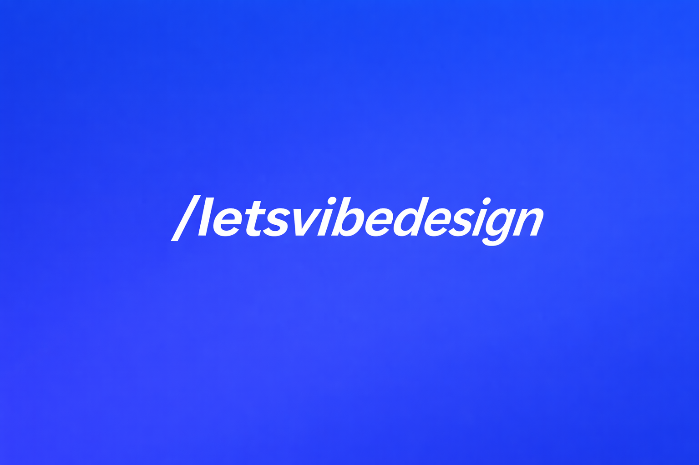

# DesysFlow OSS




<p align="left">
  
</p>

DesysFlow OSS is a local-first, agentic system design platform that converts your codebase and product goals into versioned architecture artifacts. It provides a CLI for fast iteration, a local API backend, and a lightweight UI for guided design and refinement.

It includes:
- A simple CLI (`desysflow`) for local generation and refinement
- A local FastAPI backend
- A lightweight React UI for prompting and artifact inspection

## Why DesysFlow

- Local-first workflow with repo-native outputs
- Versioned design artifacts (`v1`, `v2`, ...)
- Structured outputs (HLD, LLD, technical report, non-technical brief, diagrams, diffs)
- Provider-flexible LLM support (`ollama`, `openai`, `anthropic`)
- Optional secret-leak guardrail on LLM output
- Configurable via `desysflow.config.yml` (roles, languages, providers, defaults)

## Quick Start

### Prerequisites
- Python 3.11+
- `uv`
- Node.js + npm

### One-line install

```bash
curl -fsSL https://raw.githubusercontent.com/kmeanskaran/desysflow-oss/main/scripts/install.sh | bash
source ~/.bashrc    # or: source ~/.zshrc
letsvibedesign
```

The installer is intended for macOS, Linux, and WSL2. It clones the repo into `~/.letsvibedesign/desysflow-oss`, bootstraps the local environment, and installs a global `letsvibedesign` launcher into `~/.local/bin`.

For an existing local checkout, skip clone/fetch with:

```bash
LETSVIBEDESIGN_LOCAL_REPO="$PWD" LETSVIBEDESIGN_OFFLINE=1 ./scripts/install.sh
```

### Setup

```bash
letsvibedesign
```

Choose a mode from the prompt, or run directly:

```bash
letsvibedesign cli
letsvibedesign dev
```

## Launcher Modes

- `cli`: starts the interactive CLI loop for repeated `desysflow design` runs
- `dev`: starts API + UI together

## CLI Usage

Run the basic guided CLI:

```bash
letsvibedesign cli
```

`letsvibedesign cli` stays open after each generation and shows a `letsvibe>` prompt.

Interactive prompt commands:
- `Enter` or `run`: run again with normal interactive flow
- `design`: asks for a prompt, then runs `desysflow design --prompt "..."`
- `design <prompt>`: run directly with that prompt
- Any plain text: treated as a prompt and runs design
- `restart`: show launcher options again (`cli`, `dev`)
- `bye`: exit the CLI loop

Run directly with flags:

```bash
desysflow design --source . --out ./desysflow --project my-project
desysflow redesign --source . --out ./desysflow --project my-project --focus "improve scaling"
```

Run without prompts:

```bash
desysflow design \
  --source . \
  --out ./desysflow \
  --project my-project \
  --model-provider ollama \
  --model gpt-oss:20b-cloud \
  --language python \
  --cloud local \
  --style balanced \
  --no-interactive
```

## UI Usage

Start API + UI together:

```bash
letsvibedesign dev
```

Open:
- UI: `http://localhost:5173`
- API docs: `http://localhost:8000/docs`

In the UI:
- Open model settings from the gear icon.
- Choose `ollama`, `openai`, or `anthropic`.
- Enter the model name and API key when needed.
- Click `Check status`.
- Enter a design prompt, then use follow-up prompts to refine the result.

## Model Selection

- CLI:
  - interactive: `desysflow design` then follow prompts for provider/model/API key
  - non-interactive: `desysflow design --model-provider <provider> --model <name> [--api-key <key>]`
- UI:
  - open model settings (gear icon), choose provider/model, add API key for OpenAI/Anthropic
  - click `Check status` to run live connectivity/auth validation

Provider checks:
- OpenAI/Anthropic: verifies API key + endpoint reachability (`/models` probe)
- Ollama: verifies local endpoint reachability and that selected local model exists (`/api/tags`)

## Agentic Architecture

Primary LangGraph pipeline (`graph/workflow.py`):

1. `extract_requirements`
2. `select_template`
3. `generate_architecture`
4. `inject_edge_cases`
5. `critic_agent`
6. `revision_agent`
7. `diagram_generator`
8. `diagram_quality_agent`
9. `report_generator`
10. `cloud_infra_agent`

API also exposes additional loops on top of this base flow:
- async operation progress (`/design/async`, `/design/followup/async`)
- cloud redesign (`/design/cloud-redesign`: provider-specific diagram/report regeneration)

See [Agentic Architecture](docs/agentic-architecture.md) for more detail.

## Output Structure

DesysFlow writes versioned artifacts to `./desysflow/<project>/vN/` including:
- `HLD.md`
- `LLD.md`
- `TECHNICAL_REPORT.md`
- `NON_TECHNICAL_DOC.md`
- `diagram.mmd`
- `SUMMARY.md`
- `CHANGELOG.md`
- `DIFF.md`
- `METADATA.json`

## Configuration

Edit `desysflow.config.yml` to customize roles, languages, cloud targets, providers, and defaults. The CLI and UI both read this file at startup.

For local Ollama runs, `OLLAMA_NUM_PREDICT` controls the maximum generated tokens. Lower it if generation looks slow on small local models.

## Guardrails

Set `LLM_GUARDRAIL=true` in `.env.example` to enable secret-leak detection on LLM output. The guardrail scans for API keys, tokens, database connection strings, and other credential patterns.

## Documentation

- [Getting Started](docs/getting-started.md)
- [CLI Guide](docs/cli.md)
- [Architecture](docs/architecture.md)
- [Agentic Architecture](docs/agentic-architecture.md)
- [Examples](docs/examples.md)
- [Project Overview](docs/project-overview.md)

## Contributing

See [CONTRIBUTING.md](CONTRIBUTING.md).

## Author

- X: [@kmeanskaran](https://x.com/kmeanskaran)
- Website: [kmeanskaran.com](https://kmeanskaran.com)

## Code of Conduct

See [CODE_OF_CONDUCT.md](CODE_OF_CONDUCT.md).

## License

This project is licensed under the MIT License. See [LICENSE](LICENSE).
